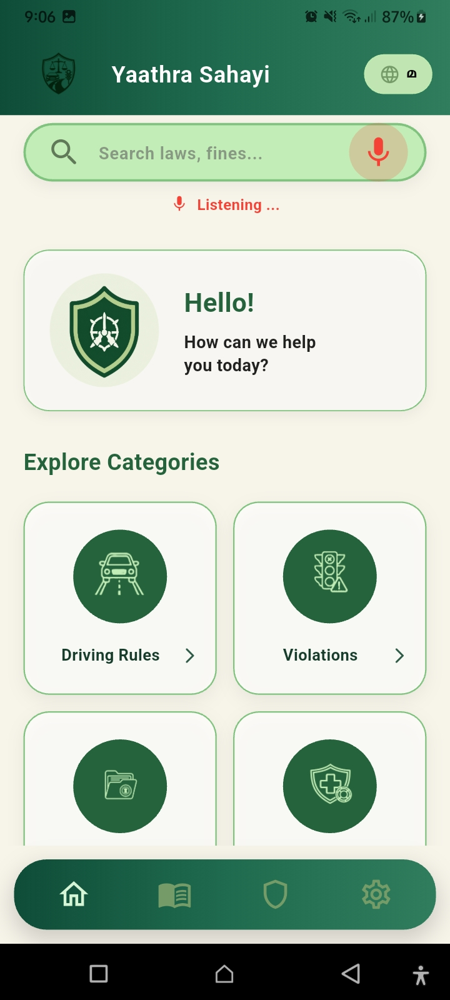
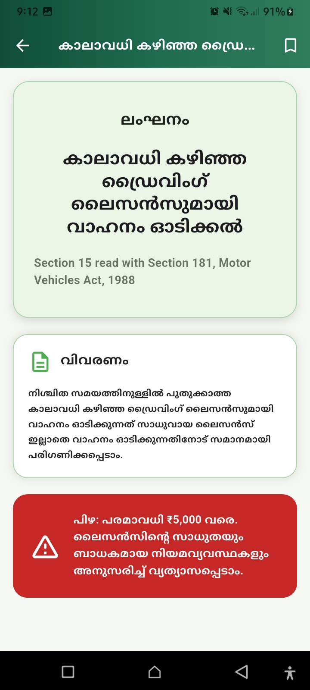
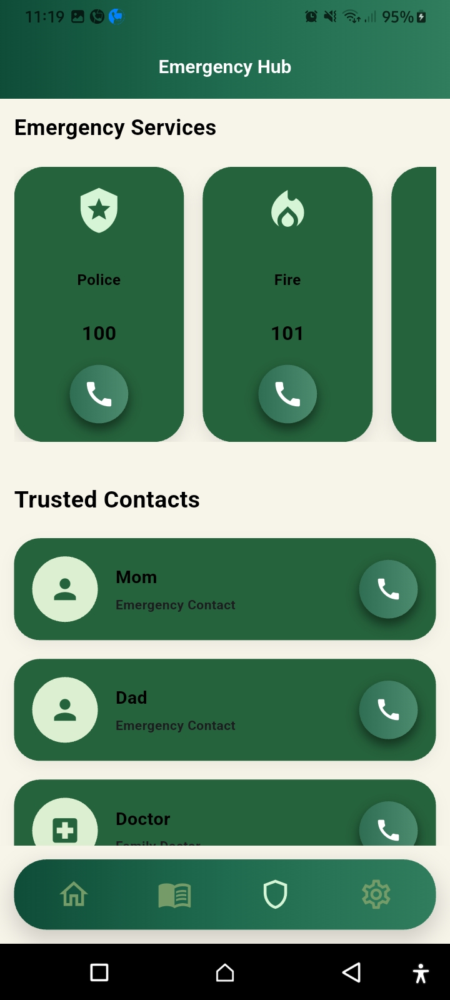
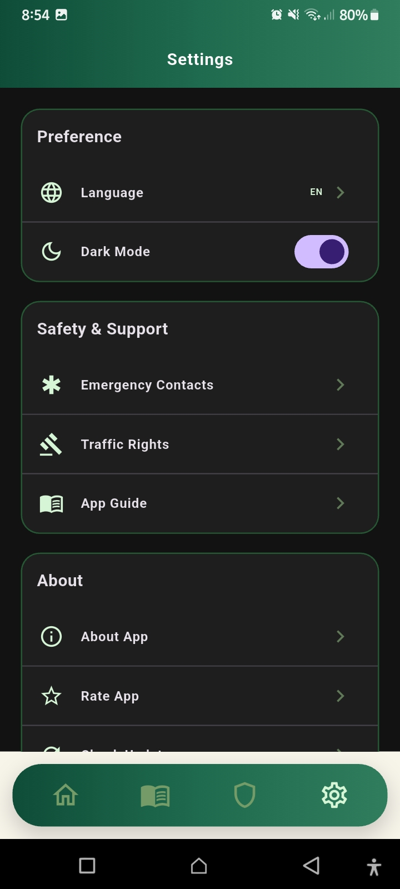
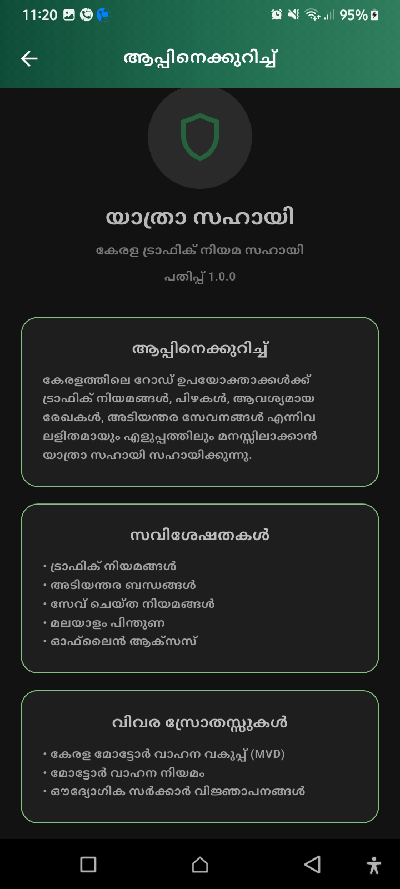

# Yaathra Sahayi

### Kerala Traffic Law Companion

Yaathra Sahayi is a Flutter-based mobile application designed to help
Kerala road users easily access traffic laws, fines, required documents,
emergency services, and traffic rights in one place.

The app provides a simple and accessible way to understand important
traffic-related information, with support for both English and Malayalam.

## 📱 Features

- 🚦 **Traffic Laws** — Browse Kerala traffic laws by category.
- 🔍 **Search** — Search traffic laws and fines quickly.
- 🎙️ **Voice Search** — Search laws using voice input.
- 🌐 **Bilingual Support** — English and Malayalam language support.
- 🔖 **Bookmarks** — Save important laws for quick access.
- 🚨 **Emergency Hub** — Access important emergency contact numbers.
- 🛡️ **Traffic Rights** — Learn about basic rights during vehicle checks,
  fine collection, and accident situations.
- 📖 **App Guide** — Learn how to use the application's features.
- 🌙 **Dark Mode** — Switch between light and dark themes.
- 📴 **Offline Access** — Access traffic law information using local JSON data.

## 🛠️ Technologies Used

- **Flutter** — Cross-platform mobile application development
- **Dart** — Application programming language
- **Provider** — State management
- **Local JSON** — Offline traffic law data
- **Speech-to-Text** — Voice search functionality
- **Material Design** — User interface components

## 📸 Screenshots

### 🏠 Home Screen

The home screen provides quick access to traffic-law search, voice search, and major traffic categories.



### 📖 Law Details

View detailed information about individual traffic violations, including the relevant Motor Vehicles Act section, description, and fine.



### 🚨 Emergency Hub

Quickly access emergency services and trusted emergency contacts.



### ⚙️ Settings

Manage language preferences, dark mode, emergency contacts, traffic rights, app guide, and other application settings.



### 🌐 Malayalam Support

The application provides Malayalam translations for important traffic-law content and application information.



## 📂 Project Structure

```text
lib/
├── models/
│   └── law_models.dart
│
├── provider/
│   ├── bookmark_provider.dart
│   ├── language_provider.dart
│   └── theme_provider.dart
│
├── screens/
│   ├── aboutscreen.dart
│   ├── app_guideScreen.dart
│   ├── bookmark_screen.dart
│   ├── categories.dart
│   ├── law_detail.dart
│   ├── sos_screen.dart
│   ├── traffic_rights_screen.dart
│   ├── homescreen.dart
│   ├── mainScreen.dart
│   ├── settings_screen.dart
│   ├── splash_screen.dart
│   └── LanguageScreen.dart
│
├── services/
│   └── law_service.dart
│
├── theme/
│   └── app_theme.dart
│
├── utils/
│   └── app_colors.dart
│
└── widgets/
    ├── action_card.dart
    ├── cards.dart
    └── custom_appbar.dart

assets/
├── data/
│   ├── drivingrules.json
│   ├── violations.json
│   ├── documents.json
│   └── safety.json
│
└── images/
    └── ...

Screenshots/
├── App_guide.jpg
├── Emerg.jpg
├── home.jpg
├── lawdetail_ml.jpg
└── settings.jpg